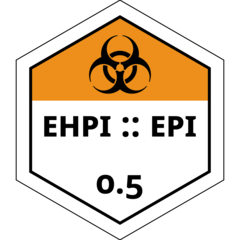

# `ehpi` 
*ehpi* is a small, but effective and thoughtful single-function package which
implements eight different compartmental epidemic models. The choice of model is
determined by the provided arguments, with only the minimal set of arguments
needed to distinguish one model from another being necessary; the default
arguments of model parameters and model options are either irrelevant to other
models, or are used in clever ways to disable or enable a compartment.

## Acknowledgements
While not given credit in the package DESCRIPTION file, [Khanh
Le](https://github.com/kle6951/) and [Tobias
Wondwossen](https://github.com/Toby-exe) each contributed their time on the job
in writing epidemic models in the episim Shiny application for which this
package is ultimately derived from and written for. Their willingness to listen
to me drone on about R and their patience with me in my first role as a lead
developer is appreciated. I hope the future of this package inspires them and
teaches them some interesting lessons in R programming.

Thanks to [Dr. Ashok Krishnamurthy](https://github.com/ashokkrish) for believing
in my skills as a developeR and happily giving me the reigns of two Shiny
applications to flex my muscles, and for teaching me about compartmental
epidemic modelling.

## Funding
This work was funded by an Alberta Innovates stipend awarded and dispensed
through Mount Royal University, in Calgary, Alberta.
